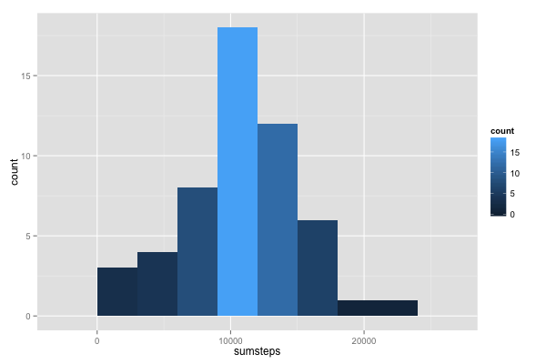
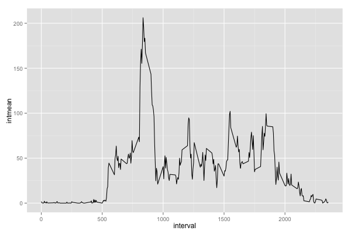
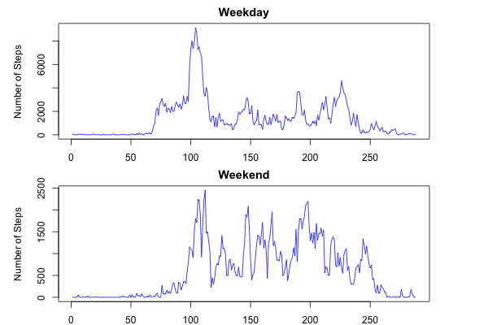

### Pre-processing and clean-up

This first step downloads the required libraries and data files.

```{r, echo=TRUE}
## required libraries
library(ggplot2)
library(dplyr)

## download file
zipurl <- "http://d396qusza40orc.cloudfront.net/repdata%2Fdata%2Factivity.zip"
download.file(zipurl, "temp.zip", mode="wb")
unzip("temp.zip", "activity.csv")
dd <- read.table("activity.csv", sep=",", header=T)
```

Next, we remove NAs and take a quick look at the data using the R summary command.

```{r, echo=TRUE}
## remove NAs
d <- dd[complete.cases(dd), ]

## quick look
summary(d)
```

### What is mean total number of steps taken per day?

The code chunk below creates a summary of the steps taken per day, creates a histogram, and calculates both the **mean** and **median** steps per day.

```{r, echo=TRUE, fig.align='center', fig.width=6, fig.height=3.5}
## summarize data
ds <- d %>% group_by(date) %>% summarise(sumsteps=sum(steps))

## histogram
png(file="figures/plot1.png", width=480, height=480)
dsum <- ggplot(data=ds, aes(x=sumsteps))
dsum + geom_histogram(aes(fill=..count..), binwidth=3000)
dev.off()

## mean number of steps taken per day
dmean <- mean(ds$sumsteps) ## mean of total number of steps
dmean

dmedian <- median(ds$sumsteps) ## median of total number of steps
dmedian
```



### What is the average daily activity pattern?

Make a time series plot (i.e. type = "l") of the 5-minute interval (x-axis) and the average number of steps taken, averaged across all days (y-axis).

```{r, echo=TRUE, fig.align='center', fig.width=6, fig.height=3.5}
## summarize and plot
dint <- d %>% group_by(interval) %>% summarise(intmean=mean(steps))

png(file="figures/plot2.png", width=480, height=480)
dintline <- ggplot(data=dint, aes(x=interval, y=intmean))
  dintline + geom_line()
dev.off()
```



Which 5-minute interval, on average across all the days in the dataset, contains the maximum number of steps?

```{r, echo=TRUE}
## max five minute interval
subset(dint, intmean == max(intmean), select=c(interval, intmean))
```

### Imputing missing values

Calculate and report the total number of missing values in the dataset (i.e. the total number of rows with NAs). Then create a new dataset that is equal to the original dataset but with the missing data filled in.

**Processing**
``` {r, echo=TRUE}
nas <- is.na(d) ## create NA index
dcln <- merge(d, dint, by="interval") ## merge in NA index
dcln$stepsx <- as.numeric(dcln$steps)
my.na <- is.na(dcln$steps)
dcln$stepsx[my.na] <- dcln$intmean[my.na] ## replace NAs with mean value
```


### Histogram of total number of steps taken per day

```{r, echo=TRUE, fig.align='center', fig.width=6, fig.height=3.5}
dclns <- dcln %>% group_by(date) %>% summarise(sumstepsx=sum(stepsx)) ## summary

png(file="figures/plot3.png", width=480, height=480)
dclnshist <- ggplot(data=dclns, aes(x=sumstepsx))
dclnshist + geom_histogram(aes(fill=..count..), binwidth=3000)
dev.off()

dmeanx <- mean(dclns$sumstepsx) ## mean of total number of steps
dmeanx

dmedianx <- median(dclns$sumstepsx) ## median of total number of steps
dmedianx
```


Calculate difference between the mean and median of the original dataset vs. the revised dataset with inputted values

```{r, echo=TRUE}
## difference in mean and median values with and without inputing
dmeandiff <- dmean - dmeanx
dmediandiff <- dmedian - dmedianx
```

The difference ends up being zero, i.e. **there is no difference between the original mean and median values from the ones with inputed value.** This is because the inputed values are the same as the mean and median from the original dataset.

**original mean - inputted mean = `r dmeandiff`**

**original median - inputted median = `r dmediandiff`**

### Are there differences in activity patterns between weekdays and weekends?

Create a new factor variable in the dataset with two levels - "weekday" and "weekend" indicating whether a given date is a weekday or weekend day.

The differences are clear when looking at the two line plots below.

```{r, echo=TRUE, fig.align='center', fig.width=6, fig.height=4.5}
## create weekeday variable
dcln$week <- weekdays(as.Date(dcln$date))

## subset into the weekday and weekend datasets
dclnweek <- subset(dcln, week == "Monday" | week == "Tuesday" | week == "Wednesday" |
                     week == "Thursday" | week == "Friday") ## week subset
dclnwend <- subset(dcln, week == "Saturday" | week == "Sunday") ## weekend subset

## create sum of steps data by interval
dclnweeksum <- dclnweek %>% group_by(interval) %>% summarize(sumstepsx=sum(stepsx))
dclnwendsum <- dclnwend %>% group_by(interval) %>% summarize(sumstepsx=sum(stepsx))

## differences between weekday and weekend activities
png(file="figures/plot4.png", width=480, height=480)
par(mfrow=c(2, 1), mar=c(2, 5, 2, 5))
plot(dclnweeksum$sumstepsx, type="l", col="blue", xlab="Interval", ylab="Number of Steps")
  title(main="Weekday", font.main=2)
plot(dclnwendsum$sumstepsx, type="l", col="blue", xlab="Interval", ylab="Number of Steps")
  title(main="Weekend", font.main=2)
dev.off()
```


